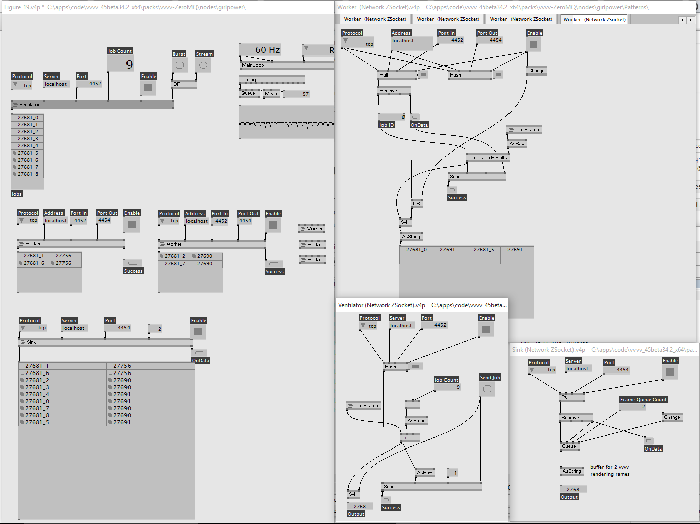

 

Introduction
============

This node pack wraps the functionality of [NetMQ](https://github.com/zeromq/netmq) ([-> Intro](http://netmq.readthedocs.org/en/latest/introduction/)), the native c# implementation of the original ØMQ, which now obviously put vvvv's networking capabilities on steroids. 
It ships with help patches for all ZSockets and some /girlpower 

This toolkit suite implements all available ZSocket types as nodes and provides uniform `Send` and `Receive` nodes that are fully spreadable. Multicore is a key feature for all of them.

It allows reliable messaging of Raw data between vvvv instances (local and remote) and overcomes problems with TCP (receive any package the way you sent it) and UDP (packages don't drop because the network is busy) by utilizing efficient handshaking and queueing. For vvvv Pros, it allows smooth async partitioning of the original root_patch into the likes of services, input handlers, database lookups, and even output driving (like good old boygrouping).

For starters, I'd recommend trying `Dealer`/`Router` pattern, or if it is more to your purpose: `Publisher`/`Subscriber`. When you know the differences, go experiment with the others, sometimes they add just the functionality you've been missing. Just don't start with `Request`/`Response`, it's a trap.

TCP and Inproc work solid so far (PGM not much tested), for quick messaging and even streaming video data. Many usages are possible for this node pack because the transport protocol does not dictate the way your payload looks like.

Configuration of Sockets can be managed with Option nodes, and `Context` can be set manually for each ZSocket. Everything spreads beautifully, as you would expect it from a vvvv pack in 2015. When interfacing with another language, vvvv's unique interface puts you in a prime position yet again.

For a in-depth introduction to ZeroMQ (and merry-go-around in general distributed architecture), consult the great [zqm Guide](http://zguide.zeromq.org/page:all).
I assume that most examples can be patched along with the guide, because it served as a great inspiration to this pack.

To Bind or to Connect, that is the question 
===========================================

To any endpoint (which is a certain address like _tcp://localhost:4444_ or _inproc://MyChannel_), you can **Bind** only one ZSocket, but a lot of ZSockets can **Connect** to it. A little bit like you could have only one Server but many Clients, just Now® with smarter choices.
Whether to Bind or Connect a socket is up to you (see Herr Inspektor), but defaults have been geared for the basic pattern use. Just remember this for now: many sockets can Connect to a certain address endpoint, but only one socket can ever be the foundation and Bind it. 

For this reason, connecting many clients to one server port and still maintaining distinctive 1:1 communication is a breeze, and with your educated decision about what Sockets to use even easier to achieve speedster throughput.

Be not afraid to experiment, the following "faults" I found so far (list extensible...)

 * One-directional nodes (`Subscriber` and `Pull`) need to be re-enabled, when the binding ZSocket drops out and comes back. 
 * Never bind two ZSockets to the same endpoint (protocol://address[:port]). Red nodes show you when something is patched wrong, but most faults are reported with a pin and a log to tty.
 * When using InProc, you'll see connecting clients in red until you bind a fit socket. They have to be in the same vvvv instance and sharing the same `Context` to communicate. By default they share the one called "Default". Who'd have figured.
 * PGM needs admin rights for vvvv and some tinkering with windows. Maybe even special epgm network hardware?
 * When substituting ZSockets in patch, vvvv can go out, especially when Sockets are still enabled. I guess that's toward the crash-early philosopy of ØMQ. Save before changing the Protocol.

On the sunny side again: This pack scales well if you feel like going crazy with all those machines and instances. Don't forget though, minimalism can be key for sanity. And -psst, it's got adapters to vvvv-Message in a separate dll to shortcut messy Raw business.

Ideas to go Further
===================

 * compiling it at your machine
 * adding and testing remaining Options in nodes 
 * designing higher-level convenience nodes for HeartBeat and Beacons for vitality announcements
 * and ofc adding nice riddles to the /girlpower folder

Ask for help at the vvvvorum.
For a quick chat please use velcrome@**jabber**.ccc.de or find help in freenode IRC channel **##vvvv**.

Authors
=======
 * Marko Ritter (www.intolight.de)

Dependencies
============

An install of vvvv, licensing for commercial work may apply.

Nuget
----
* [VVVV-sdk](https://github.com/vvvv/vvvv-sdk), LGPL
* [NetMQ](https://github.com/zeromq/netmq), LGPL 3
* [VVVV.Packs.Message.Core](https://github.com/velcrome/vvvv-Message/tree/master/src/MessageCore), LGPL 3

License
=======

